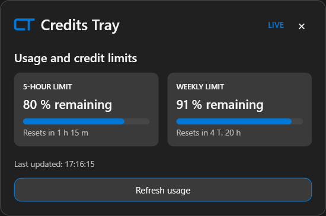

#  CreditsTray

A small Windows tray application for Codex usage information.

## Current status

- Portable WPF application that runs without administrator rights
- Tray icon with a live remaining-limit indicator
- Compact usage popup
- Local WebView2 session for the official ChatGPT usage page
- Reads visible usage text locally without sending data to a third-party server
- Provider abstraction for a future authorized API integration
- No credential handling and no external browser scraping
- Optional per-user Windows startup from the tray menu
- Restores the saved WebView2 session and refreshes usage automatically on startup

## Run

```powershell
dotnet run --project .\src\CreditsTray.csproj
```

To create a portable single-file build:

```powershell
dotnet publish .\src\CreditsTray.csproj -c Release -r win-x64 --self-contained true -p:PublishSingleFile=true -o .\publish
```

## Data access

On the first click of “Connect to ChatGPT”, a local WebView2 session opens. Sign-in happens directly in that embedded browser; the session is stored under `%LOCALAPPDATA%\CreditsTray\WebView2`. CreditsTray only reads visible text from the usage page. It has no own server and never forwards passwords or session tokens. The WebView2 Runtime must be installed on the Windows device.

## Windows startup

Use “Start with Windows” in the tray menu to enable or disable per-user startup. It writes only to the current user's `HKCU` Run key and does not require administrator rights.

## Images



